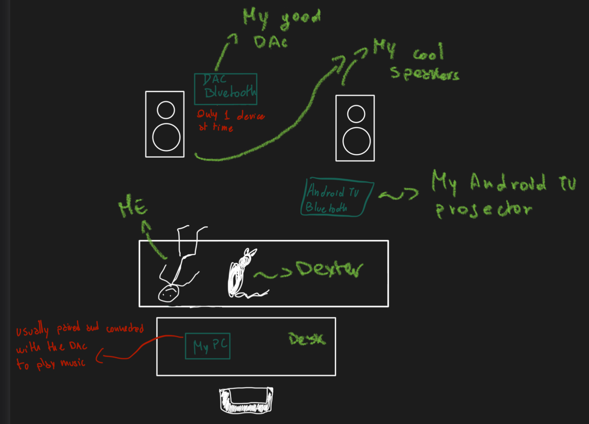

# ATV Forget

This project serve the personal purpose to disconnect my PC from my bluetooth stereo spearkers from my Android TV.

My DAC Bluetooth (Fosi Audio BT30A) has the flaw to be connected only to a single device at time.
So when I go on the sofa to watch a movie from my AndroidTV, forgetting to disconnect the PC, I have to stand up again in order to disconnect the PC and then back to the AndroidTV to connect the audio.

**Solution**: an android app that send an HTTP request to my PC which disconnect the device (and pause the music) and then restart the device bluetooth (ATV) in order to automatically connect.

> server is started on a startup shell script via crontab -e (@reboot option)
> like `python3 dev/ATV_BTForget/ServerATV.py &`